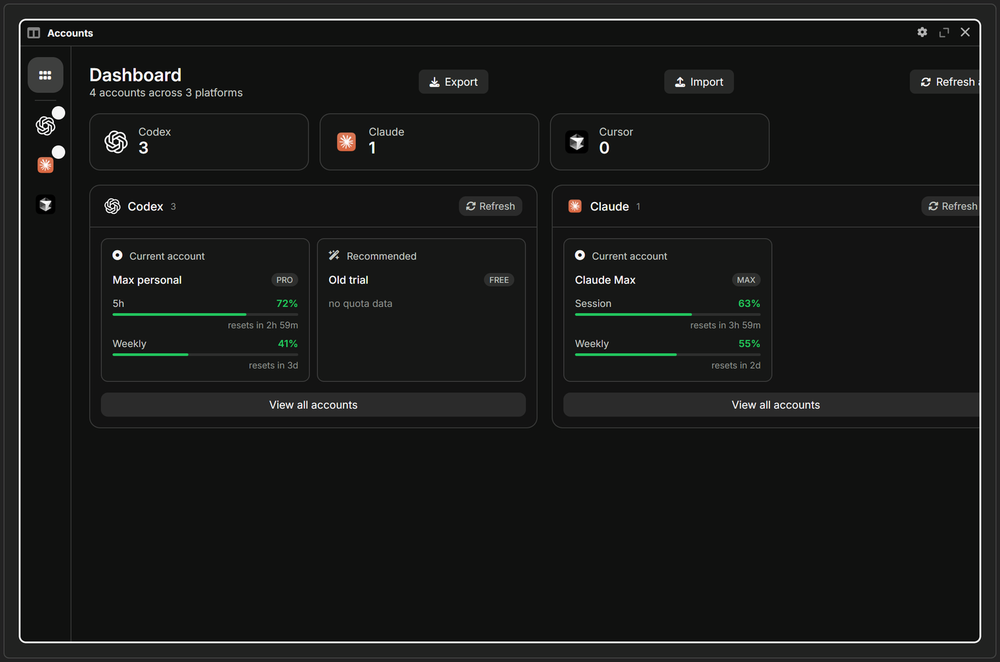
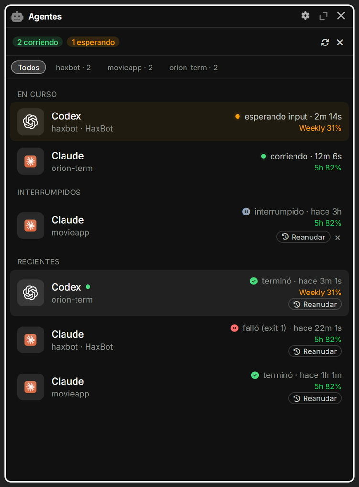

<p align="center">
  <picture>
    <source media="(prefers-color-scheme: dark)" srcset="public/logos/quasar-logo-white.png">
    <source media="(prefers-color-scheme: light)" srcset="public/logos/quasar-logo-dark.png">
    
  </picture>
</p>

<h1 align="center">Quasar</h1>

<p align="center">
  <b>A modern, agent-aware terminal.</b><br>
  Run Codex, Claude, Cursor, Copilot and friends without ever losing track of them.
</p>

<p align="center">
  <a href="https://github.com/machinebreak/quasarterm/releases"></a>
  <a href="./LICENSE"></a>
  <a href="https://github.com/machinebreak/quasarterm/actions/workflows/release.yml"></a>
  
  
</p>

<p align="center">
  
</p>

**Quasar** is a personal fork of [Wave Terminal](https://github.com/wavetermdev/waveterm) (Apache-2.0) rebuilt around one workflow: **living inside AI coding CLIs**. Wave's AI assistant, cloud services and branding are gone — in their place there's a full **account manager** and an **agent cockpit** that no other terminal has.

## Features

### 🎛 Mission Control for your agents

<p align="center">
  
</p>

- Every agent run in the workspace at a glance: **running**, **waiting for input**, **interrupted**, finished
- **Resume** an interrupted run with one click, right from the panel
- Tabs show each CLI's **logo**, plus an amber dot when an agent needs attention
- Finish detection that waits for real completion — no more false "agent finished" alerts

### 💳 Accounts & quotas, handled

- Import the account already logged into **Codex / Claude** — Cursor and others detected automatically
- One-click **switching** between accounts, with **5h / weekly quota monitoring**
- **Automatic switch** when a quota window is exhausted
- **Switch & Continue** — swap account and resume the latest conversation in the terminal
- Tags, search and batch actions across providers

### 🖥 A terminal you'd expect

- Blocks, editor & preview panes, **durable SSH sessions**, split layouts
- Project-centric tabs: the launcher drops you straight into the right folder
- **Canvas mode** (experimental): free-form windows, saved layouts and backgrounds
- Fonts, themes and keybindings fully customizable

### 🔒 Private by default

- No telemetry, no cloud services, no update pings — nothing leaves your machine
- Everything is stored locally (SQLite)

## Installation

> **Status:** v0.1.0 — early days. Windows first; macOS and Linux build from the same codebase and are planned next.

**Download** the installer from [**Releases**](https://github.com/machinebreak/quasarterm/releases). The installer is not code-signed yet, so Windows SmartScreen may ask you to confirm.

**Build from source:**

```sh
# Requirements: Node.js 22+, Go 1.25+, Task (taskfile.dev), Zig (for CGO/SQLite on Windows)
task init
task dev        # development mode
task package    # production build for the current platform
```

## Development

- **UI** — React + TypeScript (Vite) · **Shell** — Electron · **Backend** — Go (`wavesrv` + `wsh`)
- **Tests** — `npx vitest run` · **Component previews** — `cd frontend/preview && npx vite`
- **Packaging** — `task package` → artifacts in `make/` (electron-builder)

## Credits

- Built on **[Wave Terminal](https://github.com/wavetermdev/waveterm)** by Command Line Inc. (Apache-2.0). The entire foundation — terminal core, blocks, layouts, wsh — is theirs.
- Account manager UI inspired by [cockpit-tools](https://github.com/jlcodes99/cockpit-tools).

## License

Apache-2.0 — see [LICENSE](./LICENSE). Wave Terminal copyright notices are preserved in [NOTICE](./NOTICE).
Quasar is an independent fork and is not affiliated with Command Line Inc.

## Bugs & requests

Open an issue at [github.com/machinebreak/quasarterm/issues](https://github.com/machinebreak/quasarterm/issues).
